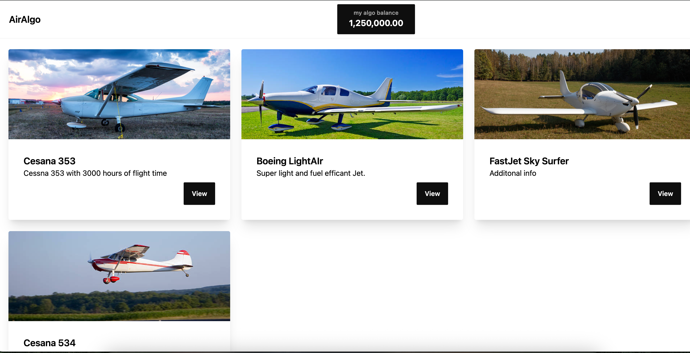
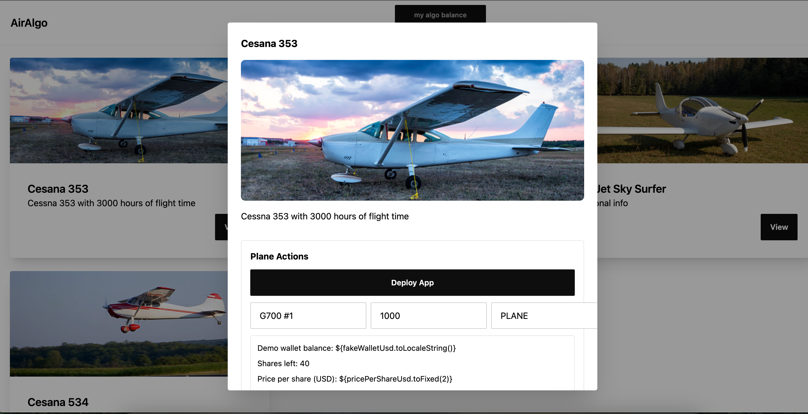

# AlgoAir

AlgoAir is a marketplace that allows for widespread access for those looking to get into private aviation at a low entry cost. Through our service, users can purchase small shares of an airplane to gain access to the skies. Transactions are also fast and seamless internationally, allowing users to skip the paperwork with international ownership!

All a user needs to do is:

1 - Link their Algorand account

2 - View planes that are on sale

3 - Decide how many shares of that plane they would like to purchase

4 - AirAlgo does the rest!

The Sellers' side is similar. The seller will list their plane (Given proof that they own it), and then state how much stake they would like to sell in that aircraft, along with a description. 

